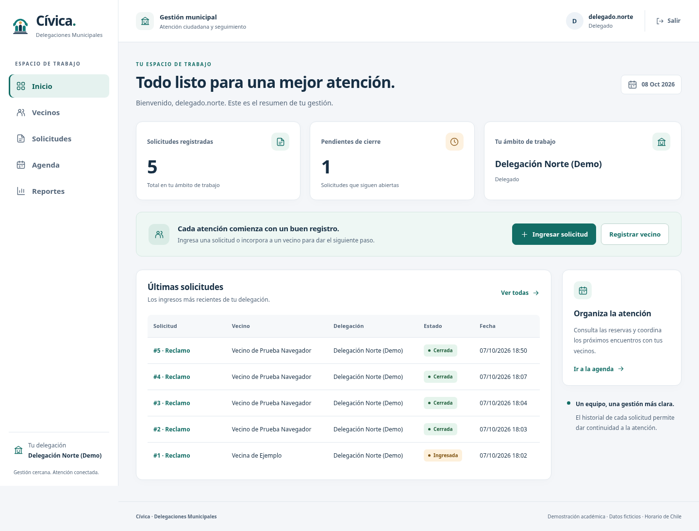
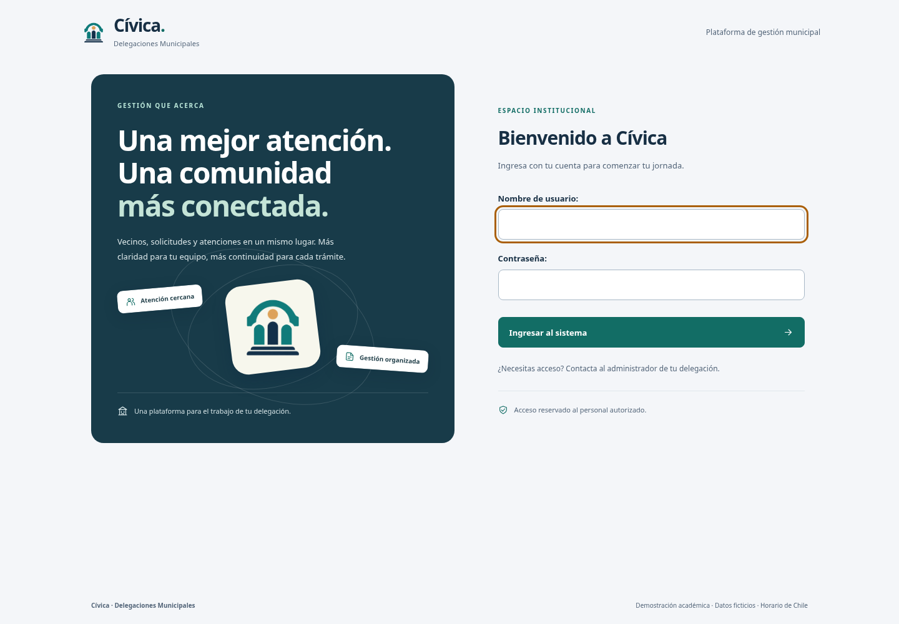

# Cívica: nueva identidad visual

Cívica es la identidad ficticia del prototipo Delegaciones Municipales. El logo original representa una comunidad bajo un arco municipal. La interfaz utiliza azul oscuro, verde y un acento dorado, con tipografía local y sin recursos visuales externos.

## Qué cambió

- Pantalla de acceso con identidad propia y formulario claro.
- Navegación con iconos y módulo activo; opciones según el rol.
- Panel con indicadores reales, solicitudes recientes y acceso a la agenda.
- Estilo compartido de tablas, filtros, formularios, estados e historial.
- Administración Django con la misma identidad.
- Adaptación a escritorio, tablet y móvil; foco visible y enlace para saltar al contenido.

Las funciones, permisos, estados y datos del sistema se conservan. El logo y la marca son ficticios: no representan una municipalidad oficial.

## Vista del panel



## Vista del acceso



## Actualizar la instancia Apache existente

Dentro de su clon de trabajo en la terminal SSH de EC2:

```bash
cd ~/Delegaciones-Municipales
git status
git pull --ff-only origin proyecto-completo
sudo bash scripts/update_apache_design.sh
```

Si `git status` muestra modificaciones propias, consérvelas antes de actualizar; no use un restablecimiento forzado. Esta actualización corresponde a la instalación nativa de la guía Apache, no a Docker.

El script guarda un respaldo de `templates` y `static` en `/var/backups/delegaciones-diseno`, copia la nueva interfaz, recoge los archivos estáticos, restaura sus etiquetas SELinux y reinicia Gunicorn. No ejecuta migraciones, no restablece cuentas ni modifica la configuración privada. Si aparece un error, conserve la salida y revise el paso indicado antes de continuar.

Abra `https://IP_PUBLICA/acceso/`. Si mantiene una pestaña antigua, actualice con Ctrl + F5. La hoja de estilos principal también cambia de URL para evitar reutilizar la versión anterior.

El script fue revisado y su sintaxis comprobada en desarrollo. Su ejecución en la EC2 y la revisión del nuevo diseño en el navegador del usuario quedan pendientes; no se ha accedido a AWS desde este entorno.

## Verificación de desarrollo

- 115 pruebas de Django aprobadas.
- 31 combinaciones de pantalla/tamaño del sistema y 9 de administración sin infracciones automáticas evaluadas ni desbordamiento general de página (1440, 768 y 390 píxeles).
- Navegación de funcionario, delegado y administrador comprobada.
- Recorrido real de navegador: registro, ciclo de solicitud, aislamiento, auditoría y salto al contenido con teclado.

Las tablas amplias conservan desplazamiento horizontal dentro de su contenedor. Las comprobaciones automáticas de accesibilidad no sustituyen una evaluación humana ni una prueba física de tablet.

Las capturas de `docs/evidencias/civica/` muestran datos ficticios. Las evidencias históricas de los sprints se conservan; las nuevas capturas del informe deben realizarse sobre la versión que finalmente se entregue.
