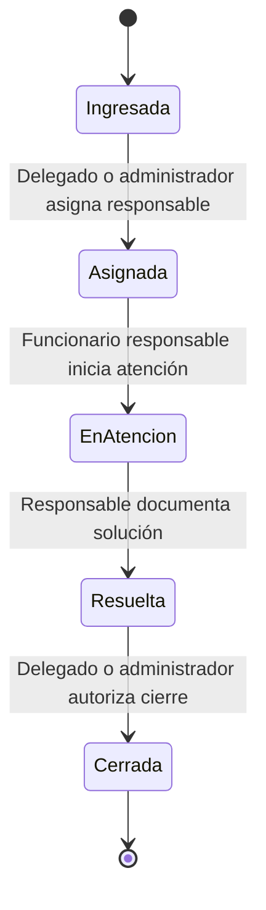
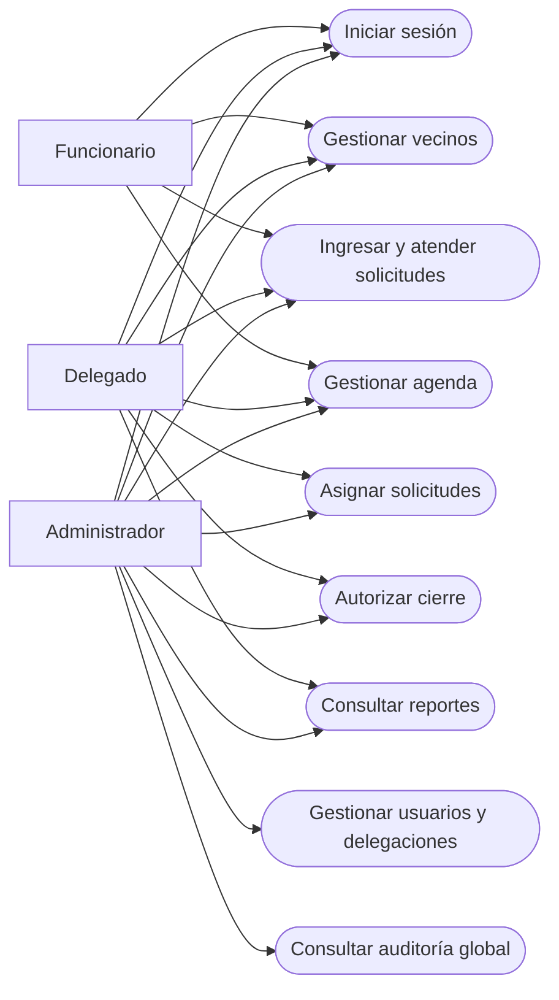
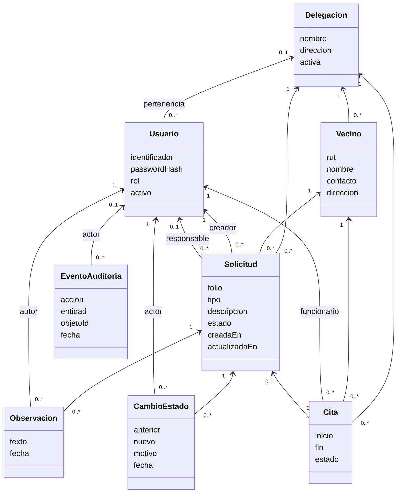
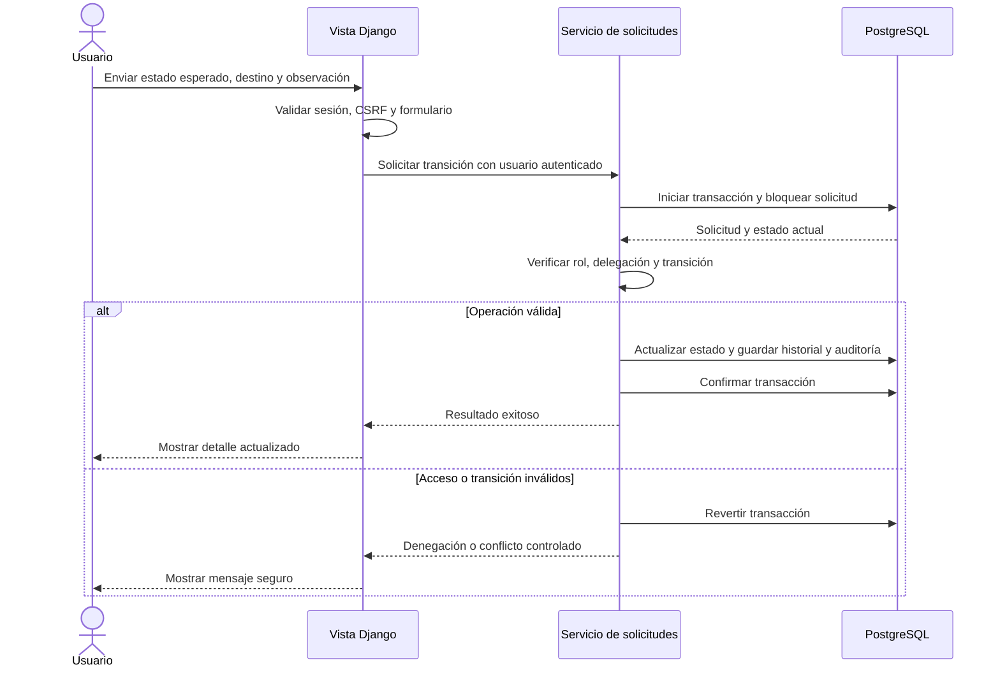

# Diseño del prototipo de Delegaciones Municipales

Estado: alcance aprobado; primer sprint y segundo incremento implementados. Verificación técnica registrada en los planes de pruebas; aceptación humana e informe final pendientes.

## Alcance y decisiones

El sistema permitirá gestionar vecinos, solicitudes, atenciones y reportes municipales. Solo los funcionarios, delegados y administradores tendrán cuentas. El prototipo empleará datos ficticios. No se incluyen pagos, firma electrónica, emisión oficial de certificados ni un portal ciudadano.

La aplicación utilizará Django, plantillas HTML y PostgreSQL. La interfaz estará en español, será adaptable a PC y tablet y permitirá navegación por teclado. Las validaciones, los permisos y los filtros por delegación se ejecutarán en el servidor.

## Arquitectura y estructura prevista

```text
Delegaciones-Municipales/
├── config/              # Configuración Django, rutas y despliegue
├── apps/
│   ├── cuentas/         # Usuarios, roles y autenticación
│   ├── delegaciones/    # Delegaciones y pertenencia de usuarios
│   ├── vecinos/         # Registro y búsqueda
│   ├── solicitudes/    # Asignaciones, estados e historial
│   ├── agenda/         # Citas y disponibilidad
│   ├── reportes/       # Consultas y agregaciones autorizadas
│   └── auditoria/      # Eventos de acciones relevantes
├── templates/          # Plantillas y componentes accesibles
├── static/             # Estilos y recursos locales
├── tests/              # Pruebas transversales y de aceptación
└── docs/               # Diseño, sprint, plan de pruebas y evidencias
```

Esta estructura orienta la implementación. Los módulos están creados; algunas vistas transversales permanecen en `config/views.py`, y las pruebas residen junto a cada aplicación. Cada módulo tiene modelos, formularios, servicios, vistas y pruebas según su responsabilidad. Las transiciones y asignaciones se concentran en servicios transaccionales para mantener consistencia entre datos e historial.

## Roles y autorización

| Operación | Funcionario | Delegado | Administrador |
|---|---|---|---|
| Registrar y editar vecinos | Su delegación | Su delegación | Todas |
| Ingresar y atender solicitudes | Su delegación | Su delegación | Todas |
| Asignar responsable | No | Su delegación | Todas |
| Autorizar cierre | No | Su delegación | Todas |
| Gestionar agenda | Su delegación | Su delegación | Todas |
| Consultar reportes | No | Su delegación | Todas |
| Gestionar usuarios y delegaciones | No | No | Sí |
| Consultar auditoría global | No | No | Sí |

Los funcionarios y delegados pertenecerán a una delegación activa. Un administrador podrá operar sobre todas. Los listados, búsquedas, detalles y modificaciones respetarán los mismos límites. Los identificadores recibidos del navegador nunca otorgarán acceso por sí solos.

## Pantallas y flujo de uso

1. Inicio de sesión con mensajes de error que no revelen si existe una cuenta.
2. Panel con solicitudes y citas visibles para el usuario.
3. Vecinos: búsqueda, alta, edición y detalle con sus solicitudes autorizadas.
4. Solicitudes: listado filtrado, alta, detalle, asignación, observaciones e historial.
5. Agenda: listado por fecha y formulario de reserva o cancelación.
6. Reportes: recuentos por estado, delegación y período, solo para roles autorizados.
7. Administración: usuarios, delegaciones y consulta de auditoría.

Los formularios tendrán etiquetas, indicación de campos obligatorios, errores asociados a cada campo y conservación de entradas válidas. El foco será visible; el estado no dependerá exclusivamente del color. Las tablas se adaptarán a pantallas pequeñas. Se comprobarán contraste, navegación con teclado y tamaños de PC y tablet.

## Modelo de datos

| Entidad | Campos y restricciones principales |
|---|---|
| Delegación | Nombre único, dirección, estado activo |
| Usuario | Identificador de acceso único, hash de contraseña, rol, delegación, estado activo |
| Vecino | Delegación, RUT normalizado y dígito verificador válido, nombre, contacto y dirección; RUT único dentro de cada delegación |
| Solicitud | Folio único, vecino, delegación, tipo, descripción, estado, creador, responsable opcional, fechas de creación y actualización |
| Observación | Solicitud, autor, texto y fecha; no se permitirá editar el historial desde la interfaz |
| Cambio de estado | Solicitud, estado anterior y nuevo, actor, motivo y fecha |
| Cita | Delegación, vecino, funcionario, inicio, fin, estado y solicitud opcional; fin posterior a inicio y sin superposición de citas activas del funcionario |
| Evento de auditoría | Actor, acción, entidad, identificador y fecha; metadatos mínimos, sin contraseñas ni contenido sensible innecesario |

La separación de vecinos por delegación evita que una búsqueda revele información de otra delegación. Las relaciones entre vecino, solicitud, responsable y cita deberán pertenecer a la misma delegación. Los registros vinculados se conservarán; la desactivación se preferirá a la eliminación de usuarios y delegaciones. El prototipo no implementará transferencias entre delegaciones.

La agenda usará fechas conscientes de zona horaria: almacenamiento UTC y presentación America/Santiago. La prevención de reservas simultáneas necesitará una transacción y bloqueo del recurso de agenda, además de validación del formulario.

## Ciclo de solicitudes



Toda transición exigirá permisos, el estado previo esperado y una observación. Delegados y administradores también podrán realizar la atención dentro de su ámbito. No habrá saltos de estado ni reaperturas en el primer prototipo. Una solicitud resuelta conservará su solución documentada antes del cierre.

## UML: casos de uso

El siguiente esquema Mermaid representa los actores y casos de uso; no utiliza la notación gráfica estricta de óvalos UML.



## UML: clases



## UML: secuencia de transición



## Seguridad y evaluación

Se utilizará el hash de contraseñas de Django, validadores de contraseña, sesiones de servidor, protección CSRF, escape automático de HTML y consultas mediante ORM. Se limitarán los intentos de acceso mediante un mecanismo compartido y se probará su comportamiento. Los secretos permanecerán fuera del control de versiones. La configuración distinguirá desarrollo y producción; HTTPS y cookies seguras deberán verificarse en un despliegue con TLS.

Las acciones sensibles producirán eventos de auditoría. La interfaz no permitirá alterar esos eventos; esto no equivale a un registro inviolable frente a administradores de la base de datos. No se usarán datos personales reales durante la demostración.

La documentación relacionará controles y pruebas con OWASP Top 10 y con la Ley 21.459, sin afirmar certificación ISO 27000 ni cumplimiento legal integral. Se documentarán alcance, resultados y limitaciones. La edición de OWASP utilizada se indicará en la matriz de pruebas.

| Criterio de la pauta | Evidencia prevista |
|---|---|
| Usabilidad y tendencias, 10% | Verificación PC/tablet, teclado y contraste; explicación SaaS, IaaS y Cloud |
| Normativas, 15% | Permisos, protección de datos, auditoría y análisis normativo con fuentes |
| Buenas prácticas, 15% | Módulos, documentación y control de versiones |
| Plan de pruebas, 30% | Casos unitarios, integración y aceptación; resultados de ejecución |
| OWASP, 20% | Matriz de controles y pruebas de seguridad |
| Correcciones, 10% | Registro de defectos, cambios y resultados de repetición |

## Propuesta del primer sprint

El sprint construirá un recorrido completo de solicitud: autenticación, delegaciones y roles, registro de vecino, ingreso, asignación, atención, resolución y cierre, con historial y auditoría. Incluirá datos ficticios y pruebas de validación, permisos por delegación y transiciones. Agenda y reportes se incorporarán en el siguiente incremento, dentro del alcance aprobado.

Criterios de aceptación del primer sprint:

- Cada rol inicia y cierra sesión; los accesos no autorizados se deniegan en el servidor.
- Se valida el RUT y se impiden duplicados dentro de una delegación.
- Una solicitud completa todo el ciclo con los permisos establecidos.
- Los usuarios de una delegación no leen ni modifican registros de otra.
- Cada transición deja historial y auditoría dentro de la misma transacción.
- Las pantallas principales funcionan en PC/tablet y con teclado.
- Las pruebas ejecutadas tienen resultados documentados y los defectos se distinguen de lo aún no implementado.

Este sprint se implementó después de la confirmación del usuario y superó 38 pruebas en su ejecución inicial. El segundo incremento incorpora agenda y reportes, con UML complementario y resultados en `docs/pruebas-sprint-2.md`. Los resultados de aceptación humana se registrarán cuando el usuario pruebe el sistema; no se consideran aprobados por una ejecución automática.
