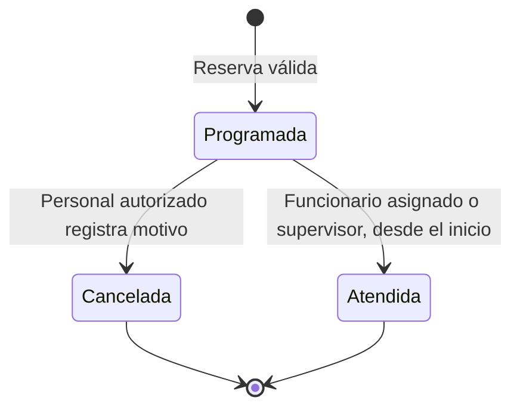
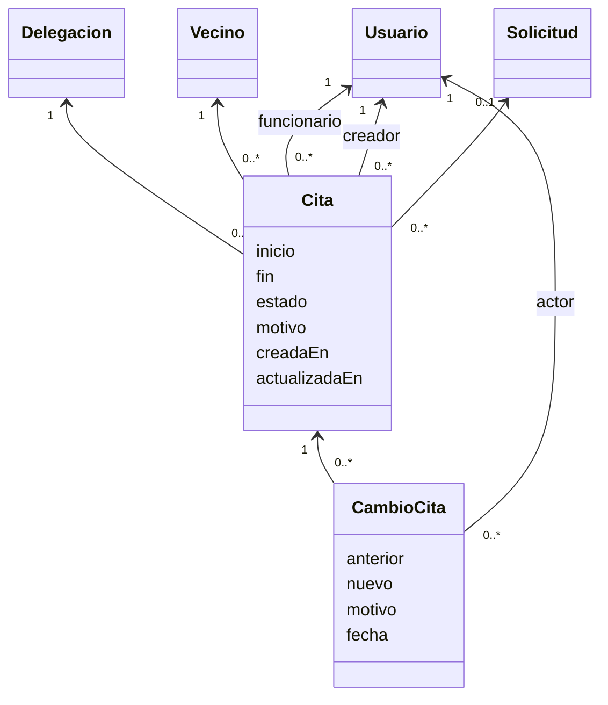
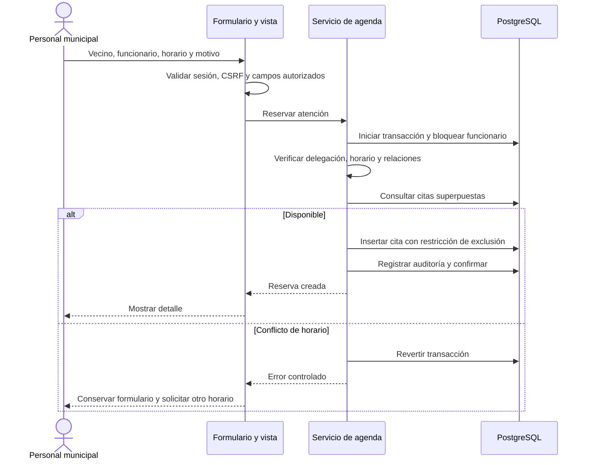

# Agenda y reportes — Diseño, pruebas y resultados

Fecha de ejecución: 7 de octubre de 2026. La implementación y la verificación técnica de este incremento están terminadas; la aceptación humana y el informe académico final están pendientes.

## Alcance implementado

La agenda permite reservar atenciones de 15, 30, 45 o 60 minutos con un funcionario activo de la misma delegación que el vecino. Admite una solicitud relacionada del mismo vecino y delegación, que no esté cerrada. Se puede cancelar la cita y conservar el historial; se puede registrar una atención realizada una vez alcanzada su hora de inicio. Para reprogramar se cancela y se reserva nuevamente.

Los funcionarios y delegados gestionan citas de su delegación; el administrador gestiona todas las activas. Todos pueden cancelar dentro de su ámbito. Solo el funcionario asignado o un supervisor autorizado pueden registrar la atención realizada. La desactivación o el cambio de rol/delegación del funcionario se rechazan mientras tenga citas programadas. Estos controles se validan desde los formularios de administración; las escrituras directas en base de datos requieren una gestión autorizada y no equivalen al flujo de la aplicación.

Las horas se almacenan con zona horaria y se muestran en America/Santiago. Se rechazan horarios pasados y horas inexistentes o ambiguas en cambios estacionales. No se han inventado horarios de oficina, feriados, recordatorios, pagos o capacidad de atención por sala. Un vecino puede tener citas con funcionarios diferentes en el mismo horario; la restricción aprobada de disponibilidad corresponde al funcionario.

Los reportes son exclusivos de delegados y administradores. Se filtran por estado actual, delegación y fecha de ingreso de las solicitudes, no por la fecha de sus cambios de estado. Las fechas inicial y final son inclusivas en horario de Chile. Se presentan totales por estado, por delegación y detalle paginado. Los filtros inválidos no amplían la consulta; muestran errores y resultados vacíos. No se exportan datos personales.

## Integridad y concurrencia

La reserva bloquea transaccionalmente el registro del funcionario antes de comprobar su disponibilidad. PostgreSQL impide además superposiciones mediante una restricción de exclusión sobre el funcionario y el intervalo `[inicio, fin)`, para citas programadas. Esto permite citas consecutivas y protege frente a escrituras que omitan el servicio de aplicación. La migración habilita `btree_gist` para combinar igualdad del identificador e intersección de fechas.

La cancelación y el registro de atención bloquean la cita, comprueban el estado esperado y guardan el nuevo estado, su historial y la auditoría dentro de una misma transacción. Una cita finalizada no puede cambiar nuevamente de estado. Los fallos de auditoría revierten la operación.

## UML: estados de la atención



## UML: clases complementarias



## UML: secuencia de reserva



## Plan de pruebas aplicado

| ID | Tipo | Comprobación | Resultado esperado | Resultado |
|---|---|---|---|---|
| CP-25 | Integración | Reserva y auditoría | Cita programada, intervalo correcto y evento asociado | Aprobado |
| CP-26 | Unidad/validación | Fecha pasada, sin zona o duración inválida | Rechazo sin crear cita | Aprobado |
| CP-27 | Seguridad | Vecino o funcionario de otra delegación | Denegación en formulario y servicio | Aprobado |
| CP-28 | Integración | Funcionario inactivo o con otro rol | Rechazo de reserva | Aprobado |
| CP-29 | Integración | Solicitud ajena al vecino o cerrada | Rechazo de relación inconsistente | Aprobado |
| CP-30 | Integración/PostgreSQL | Superposición y horarios adyacentes | Rechazar superposición y admitir citas consecutivas | Aprobado |
| CP-31 | Concurrencia | Dos reservas simultáneas | Una cita y un solo evento de reserva | Aprobado |
| CP-32 | Integridad | Escritura directa superpuesta o fin inválido | Rechazo mediante restricciones PostgreSQL | Aprobado |
| CP-33 | Funcional | Cancelación | Conservar historial y liberar horario | Aprobado |
| CP-34 | Seguridad | Registrar atención antes del inicio o por colega | Rechazo; permitir al responsable desde el inicio | Aprobado |
| CP-35 | Integración | Estado desactualizado, cita terminal o motivo vacío | Rechazo sin cambiar historial | Aprobado |
| CP-36 | Integración | Fallo de auditoría en reserva/cancelación | Rollback completo | Aprobado |
| CP-37 | Seguridad | Detalle y mutación de cita ajena | 404, sin revelación ni cambio | Aprobado |
| CP-38 | Seguridad | CSRF, GET de modificación y contenido XSS | Rechazo de mutación y escape de contenido | Aprobado |
| CP-39 | Usabilidad | Superposición desde formulario | Error comprensible y datos conservados | Aprobado |
| CP-40 | Integración | Cambiar rol, delegación o actividad con citas pendientes | Validación de cuenta | Aprobado |
| CP-41 | Validación temporal | Hora inexistente en cambio estacional chileno | Rechazo del formulario | Aprobado |
| CP-42 | Funcional | Agenda por fecha y estado | Mostrar solamente coincidencias autorizadas | Aprobado |
| CP-43 | Seguridad | Funcionario accede a reportes | 403 y enlace omitido | Aprobado |
| CP-44 | Seguridad | Reportes del delegado y administrador | Delegado limitado; administrador con todas las autorizadas | Aprobado |
| CP-45 | Funcional | Fechas inclusivas, un día y filtros combinados | Totales exactos, incluidos límites locales | Aprobado |
| CP-46 | Seguridad/validación | Período invertido, fecha/estado inválido o delegación ajena | Errores y resultados vacíos, sin ampliar acceso | Aprobado |
| CP-47 | Integración | Totales por estado/delegación | Sumas iguales al total filtrado | Aprobado |
| CP-48 | Navegador | Reserva, conflicto, cancelación y nuevo uso del horario | Recorrido funcional con historial y auditoría | Aprobado |
| CP-49 | Navegador | Reportes y permisos | Recuentos correctos y accesos ajenos rechazados | Aprobado |
| CP-50 | Accesibilidad | Pantallas del incremento en PC/tablet | Sin infracciones automáticas evaluadas | Aprobado automáticamente; aceptación humana pendiente |

Los IDs agrupan escenarios. La suite completa ejecutó **88 pruebas: 88 aprobadas**, sin omisiones ni fallos. Incluye las 38 del primer sprint y 50 nuevas de agenda y reportes. Las dos pruebas de concurrencia utilizan conexiones independientes y PostgreSQL real: asignación de solicitudes y reserva de citas.

El recorrido de navegador confirmó reserva, rechazo de superposición, cancelación, reutilización del horario, permisos entre delegaciones, reportes, auditoría y presentación en PC/tablet. Se guardaron capturas con datos ficticios. El registro de atención realizada se verificó mediante pruebas del servicio con reloj controlado; no se marcó artificialmente una cita futura como atendida en la aplicación.

La auditoría automática axe-core revisó 11 pantallas en dos tamaños, 1440×1024 y 768×1024: **22 combinaciones**, sin infracciones automáticas de las reglas WCAG A/AA evaluadas ni desborde horizontal de la página. Las tablas pueden desplazarse dentro de sus contenedores. Los resultados señalan comprobaciones manuales pendientes; no demuestran conformidad completa con WCAG.

## Comandos de reproducción

```sh
sh scripts/install.sh
sh scripts/start.sh
# En otra terminal, desde el repositorio:
.venv/bin/python manage.py test apps
.venv/bin/python manage.py makemigrations --check --dry-run
DJANGO_DEBUG=false .venv/bin/python manage.py check --deploy
.venv/bin/python scripts/smoke_sprint_2.py
.venv/bin/python scripts/check_accessibility.py /tmp/municipal-axe/package/axe.min.js
```

La comprobación de despliegue valida opciones de Django; no demuestra un despliegue HTTPS real. Las comprobaciones de navegador requieren Chromium, dependencias de `requirements-dev.txt` y el servidor activo. La auditoría de accesibilidad requiere una copia local verificada de axe-core; la ruta indicada corresponde a esta ejecución.

## Incidencias y correcciones

Durante la verificación, el proceso de desarrollo anterior seguía usando las rutas del primer sprint y ocupaba el puerto. Se detuvo ese proceso, se reinició con los módulos nuevos y se repitió el recorrido. No se alteraron datos para resolver el problema.

El primer script del segundo recorrido intentó consultar Django desde el contexto de ejecución de Playwright y fue rechazado por la protección de operaciones síncronas. Las consultas de referencia se trasladaron antes del inicio del navegador. También se corrigió la ubicación de una comprobación de rol dentro de la suite. La ejecución final de 88 pruebas y el recorrido de navegador aprobaron; los fallos iniciales no se presentan como resultados finales aprobados.

## Evidencias y siguiente etapa

`docs/evidencias/` contiene capturas de agenda y reportes, el resumen de accesibilidad y un PDF de las pantallas del incremento. No incluye credenciales ni datos personales reales.

Las funciones principales del alcance acordado están implementadas. Quedan la revisión humana, el análisis ampliado de seguridad y normativa y la preparación del informe académico con portada, índice, glosario y bibliografía APA. La matriz de OWASP del primer sprint sigue siendo una evaluación parcial; no se declara cumplimiento del 100%, certificación ISO ni conformidad legal integral.
